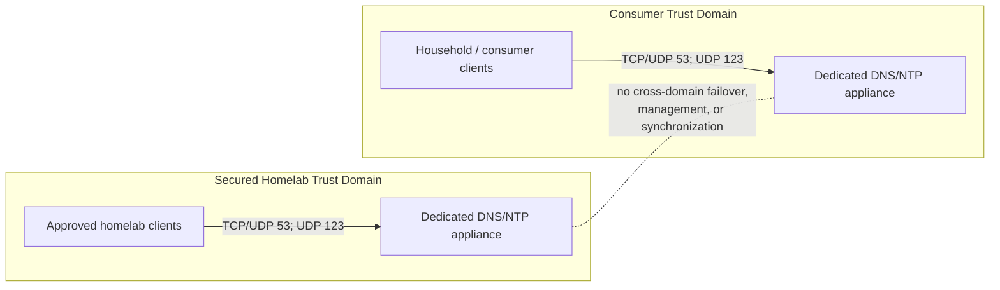
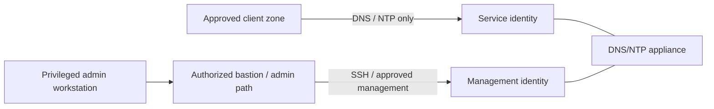
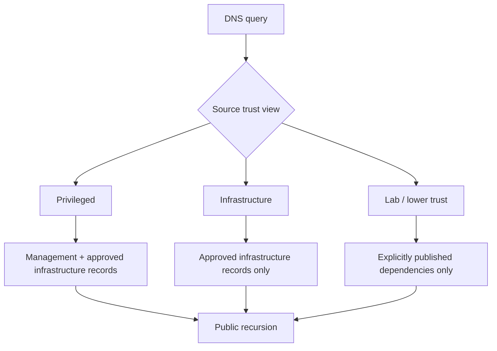

# DNS/NTP Appliance Architecture

## 1. Objective

Provide reliable DNS and NTP to multiple homelab trust zones without turning foundational infrastructure into a bridge between security domains.

The architecture deliberately separates:

1. secured-homelab infrastructure from consumer infrastructure;
2. service consumption from administrative authority;
3. DNS visibility from network authorization;
4. configuration staging from production exposure.

## 2. Trust-Domain Model

Two independent appliances are used.



A failure in one trust domain does not cause clients to fall back to the appliance in the other domain.

Future redundancy should be added *inside* each trust domain.

## 3. Management Plane vs Service Plane

Service access does not imply administrative access.



The precise production network path is intentionally omitted from the public repository.

### Invariant

> A network may be authorized to consume DNS and/or NTP while remaining completely unauthorized to manage the appliance.

This prevents a common design mistake where access to a foundational service also creates an unintended path into its operating system.

## 4. Component Responsibilities

| Component | Responsibility |
|---|---|
| Debian | Minimal operating-system platform |
| Unbound | Validating recursive DNS and controlled internal records |
| Chrony | Upstream time synchronization and, after validation, limited internal NTP service |
| nftables | Host-level default-deny ingress/forwarding policy |
| Network firewall/router | Primary inter-zone authorization boundary |
| Bastion/admin path | Narrowly scoped appliance administration |
| Ansible | Planned reproducible configuration management |

The appliance is intentionally **not** a router, NAT gateway, VPN gateway, general-purpose application host, container platform, file server, DHCP server, or bastion.

## 5. DNS Architecture

### 5.1 Recursive DNS

Unbound performs validating recursion for public DNS.

The intended controls include:

- DNSSEC validation;
- identity/version hiding;
- query hardening;
- QNAME minimization;
- minimal responses where practical;
- explicit access control;
- source-aware internal views.

### 5.2 Split-View Internal DNS

Different trust levels receive different internal information.

The public examples use documentation-only records:

```text
mgmt.internal.example
infra.internal.example
lab.internal.example
```

Example policy:



A lower-trust query for a privileged internal name should receive a non-disclosing result such as NXDOMAIN.

This is **information minimization**, not an access-control substitute. Network firewalls still decide whether the destination itself is reachable.

## 6. NTP Architecture

Chrony is brought online in two stages.

### Stage A — Client only

1. configure upstream sources;
2. validate configuration parsing;
3. restart Chrony;
4. verify healthy source selection and synchronization;
5. confirm no internal NTP listener is exposed.

### Stage B — Internal server

Only after Stage A passes:

1. add explicit client authorization;
2. permit UDP/123 in the host firewall only from approved zones;
3. add matching inter-zone policy;
4. validate permitted clients;
5. validate denied clients;
6. restrict arbitrary direct Internet NTP where appropriate.

The appliances synchronize independently rather than using one another as upstream sources.

## 7. Network Policy Model

The public repository intentionally represents authorization symbolically.

| Source class | DNS | NTP | Management |
|---|---:|---:|---:|
| Privileged infrastructure | Allow as required | Allow as required | Only through approved admin path |
| Ordinary lab workloads | Explicit allow | Explicit allow | Deny |
| Consumer clients | Consumer appliance only | Consumer appliance only | Deny |
| Unapproved/guest sources | Deny unless specifically justified | Deny unless specifically justified | Deny |
| Internet-originated traffic | Deny | Deny | Deny |

Host-level and network-level controls are expected to agree.

## 8. Egress Model

A production deployment should progressively move toward explicit egress.

Typical justified flows include:

| Purpose | Typical requirement |
|---|---|
| Full recursive DNS | TCP/UDP 53 to authoritative DNS infrastructure |
| NTP synchronization | UDP 123 to approved time sources |
| NTS, if used | TCP 4460 to approved NTS endpoints |
| OS updates | HTTPS to approved package repositories |

Cross-domain appliance traffic is denied by default.

## 9. Logging and Monitoring

The appliance should record enough data to diagnose security and availability failures without becoming a general monitoring server.

Useful events include:

- service startup/configuration failures;
- DNSSEC validation errors;
- serious resolver errors;
- Chrony synchronization/source failures;
- SSH and privilege-escalation events;
- significant host-firewall denies;
- update failures;
- unexpected reboots;
- resource exhaustion.

Continuous DNS query logging is not required by default because it can create privacy-sensitive browsing records and unnecessary storage writes.

## 10. Recovery Model

Recovery must not depend on the services being recovered.

The design requires a local-console path that remains usable if any of the following are unavailable:

- DNS;
- NTP;
- remote access;
- the bastion path;
- the companion DNS/NTP appliance.

Known-good configuration backups should be retained so a bad DNS, NTP, or firewall change can be rolled back locally.

If system integrity is uncertain after a security incident, rebuilding from known-good configuration is preferred over assuming an in-place cleanup is trustworthy.

## 11. Deployment Method

The deployment follows an exposure-last sequence:

```mermaid
flowchart LR
    A["Build minimal OS"] --> B["Harden host"]
    B --> C["Configure service locally"]
    C --> D["Parse / syntax validation"]
    D --> E["Runtime validation on loopback"]
    E --> F["Negative policy testing"]
    F --> G["Open host firewall narrowly"]
    G --> H["Open network policy narrowly"]
    H --> I["Validate from real trust zones"]
    I --> J["Reboot / recovery validation"]
    J --> K["Automate known-good state"]
```



This reduces the chance that an incorrect service policy becomes reachable before it is understood.
